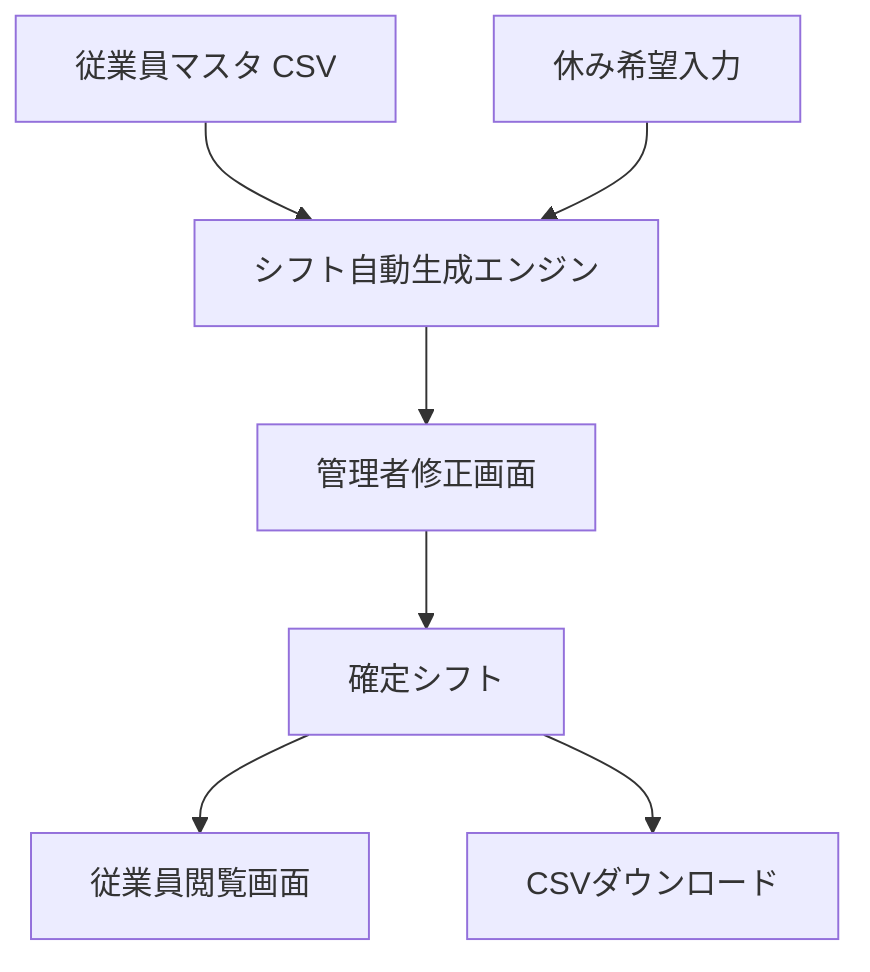
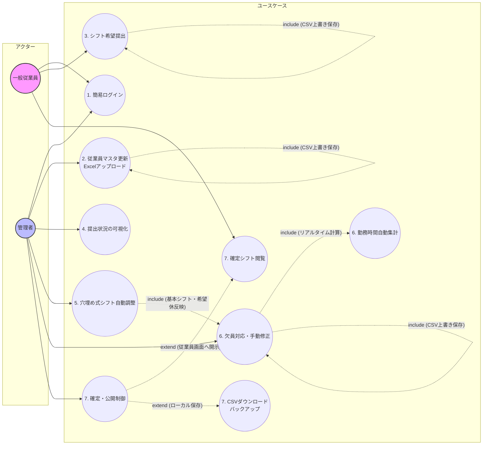
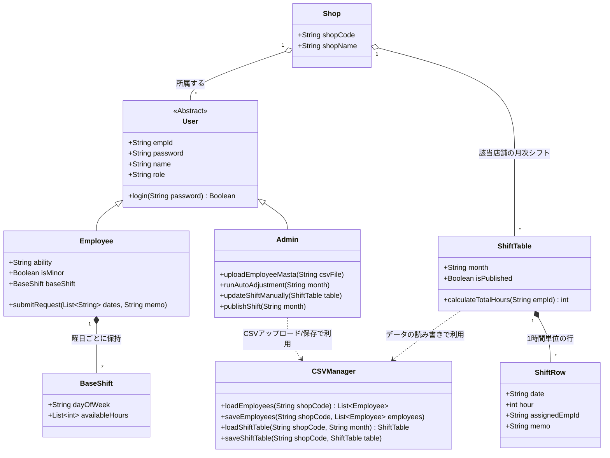
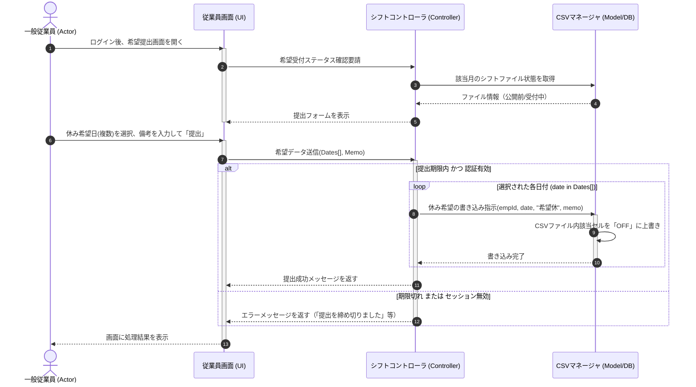
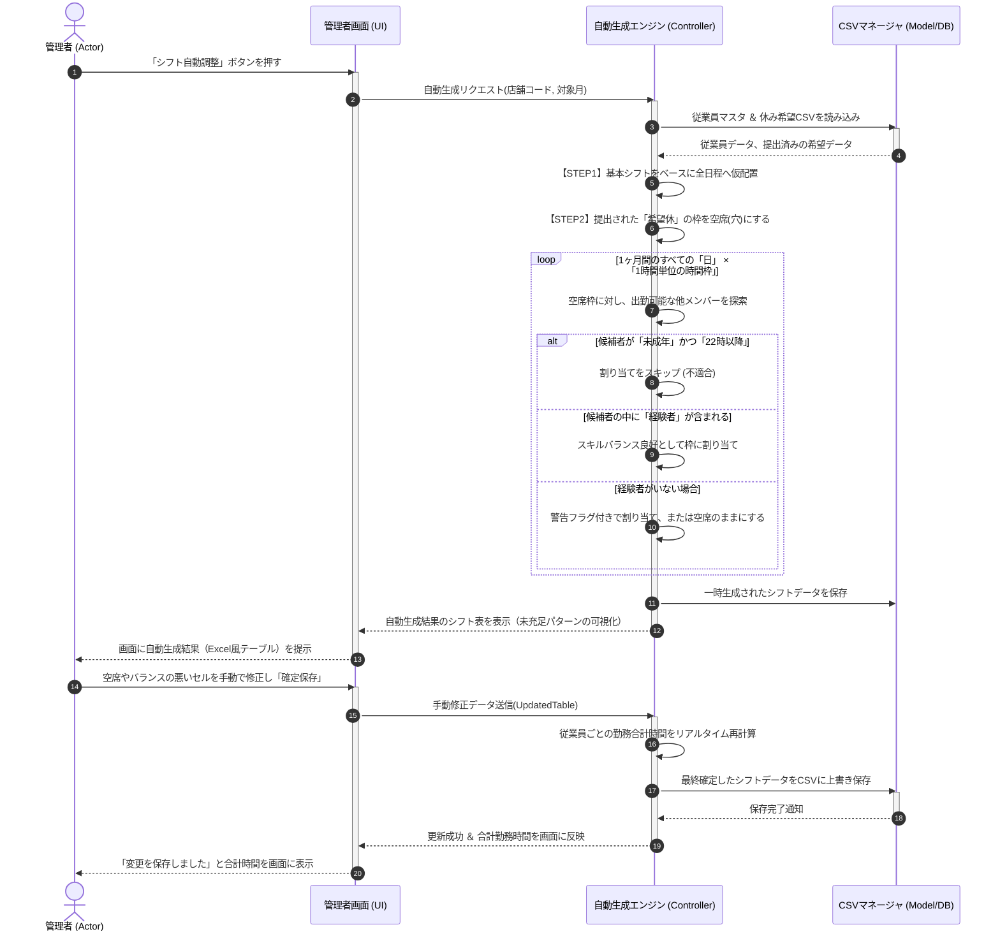
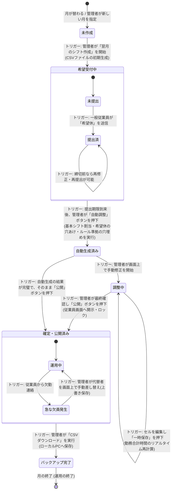

# sysytem_test

# シフト自動調整管理アプリ 要件定義書

## 1. プロジェクト概要

### システム名

簡易複数店舗対応型・シフト自動調整管理アプリ

### 開発期間

4週間

### 概要

複数店舗・部門に対応し，従業員の基本シフトと月次の休み希望を組み合わせて，スキルバランスや法令上の制約を考慮した月間シフト表を自動生成・管理するWebアプリケーションである．

### 使用技術

* Python
* Streamlit
* Streamlit Community Cloud
* CSVファイル管理

---

## 2. システム目的

本システムは，複数店舗におけるシフト作成業務を効率化することを目的とする．

以下の3ステップでシフトを作成する．

1. 基本シフトの自動配置
2. 希望休の反映
3. ルールベースの自動穴埋め

これにより管理者のシフト作成負担を軽減する．

---

## 3. システム構成



---

## 4. ユーザー区分

| 区分    | 利用機能               |
| ----- | ------------------ |
| 一般従業員 | 希望休提出，確定シフト閲覧      |
| 管理者   | 従業員管理，自動生成，手動修正，公開 |

---

## 5. 機能要件

### 共通機能

#### FR-01 簡易ログイン

* 店舗コード
* 従業員ID
* パスワード

を用いて認証を行う．

ユーザー権限に応じて画面を分岐する．

---

### 一般従業員機能

#### FR-02 希望休提出

* 日単位で休み希望を登録
* 備考入力可能
* 保存可能

#### FR-03 確定シフト閲覧

* 管理者公開後に閲覧可能
* 月間シフトを確認可能

---

### 管理者機能

#### FR-04 従業員マスタ管理

管理者画面のUIフォームから従業員の追加・契約解除（削除）を行う．
また，登録時に曜日や日数の矛盾チェックを実施し，データ整合性を担保する．

管理項目
* 基本情報（従業員ID，パスワード，氏名，役割）
* シフト条件（通常出勤曜日・時間，追加可能曜日・時間，絶対NG曜日）
* 制限設定（週最大出勤日数，週制限超過許可）
* 経験者フラグ
* 未成年フラグ

#### FR-05 提出状況確認

各従業員の提出状況を表示する．

* 提出済
* 未提出

#### FR-06 シフト自動生成

以下のルールを適用する．

1. 基本シフトを配置
2. 希望休を反映
3. 空き枠を自動補完

##### 制約条件

* 各時間帯に経験者を1名以上配置
* 未成年者は22時以降勤務不可
* 絶対NG曜日に指定された日は割り当てない
* 各従業員の「週最大出勤日数」を超過しない（超過許可フラグONの場合は除く）

#### FR-07 シフト手動修正

* セル単位編集
* ドロップダウン選択
* 即時保存

#### FR-08 労働時間集計

従業員ごとの総勤務時間を自動計算する．

#### FR-09 シフト公開

公開ボタン押下後に従業員へ反映する．

#### FR-10 CSV出力

完成したシフト表をCSV形式でダウンロードする．

---

## 6. 非機能要件

### 性能

* ログイン：5秒以内
* 画面遷移：5秒以内
* 自動生成処理：5秒以内

### セキュリティ

* 権限制御を実施
* パスワード暗号化は行わない

### ユーザビリティ

* Streamlit標準UIを利用
* 表形式編集を採用

### 保守性

* SQLは使用しない
* CSVファイル管理とする
* 手動修復可能なデータ構造とする

---

## 7. データ構造

### employees.csv

| 項目 |
| --- |
| 店舗コード |
| 従業員ID |
| パスワード |
| 氏名 |
| 役割 |
| 通常出勤曜日 |
| 通常開始時刻 |
| 通常終了時刻 |
| 追加可能曜日 |
| 追加可能開始時刻 |
| 追加可能終了時刻 |
| 絶対NG曜日 |
| 週最大出勤日数 |
| 週制限超過許可 |
| 経験者フラグ |
| 未成年フラグ |

### shifts_YYYY_MM.csv

| 項目    |
| ----- |
| 日付    |
| 店舗コード |
| 時間    |
| シフト枠1 |
| シフト枠2 |
| 備考    |

---

## 8. 非目標

以下の機能は開発対象外とする．

* ユーザー新規登録
* パスワード再発行
* 時間単位の休暇申請
* 勤務時間超過アラート
* 給与計算
* 他システム連携
* LINE通知
* メール通知
* PDF出力
* 高度なセキュリティ機能

---

## 9. 開発優先度

| 優先度 | 対象機能                      |
| --- | ------------------------- |
| 高   | ログイン，休み希望，自動生成，マスタ管理，手動修正 |
| 中   | 提出状況確認，公開機能，労働時間集計        |
| 低   | なし                        |


# システム構成図

## 1. ユースケース図




## 2. クラス図



## 3. シーケンス図

### 3.1. 従業員のシフト提出


### 3.2. 管理者によるシフトの自動調整および手動調整


## 4. 状態遷移図


# 開発環境およびGitHubリポジトリ

## 開発環境

本システムは以下の環境で開発および動作確認を行っている．

### OS
* Windows 10 / Windows 11

### 使用言語
* Python 3.12以上

### 使用フレームワーク
* Streamlit

### 使用ライブラリ
* streamlit
* pandas
* numpy
* openpyxl
* その他 `requirements.txt` に記載されたライブラリ

### 開発ツール
* Visual Studio Code
* GitHub
* GitHub Desktop

---

## 開発環境構築

本プロジェクトは，Windows標準のPython環境と付属のバッチファイルを用いて，容易に環境構築が可能な構成となっている．
Anaconda環境は不要である．

### 1. 事前準備：Pythonのインストール
本システムを動作させるためには，PCにPythonがインストールされており，コマンドプロンプトから呼び出せる状態（PATHが通っている状態）である必要がある．
Pythonが未インストールの場合は，以下の手順で導入する．

1. [Python公式サイト](https://www.python.org/downloads/)にアクセスし，Windows用のインストーラ（Python 3.11 または 3.12 推奨）をダウンロードする．
2. ダウンロードしたインストーラ（`.exe`ファイル）を起動する．
3. **【最重要】** 最初のインストール画面の下部にある **「Add python.exe to PATH」** （または「Add Python 3.x to PATH」）のチェックボックスに**必ずチェックを入れる**．
   ※このチェックを忘れると，後述の自動セットアップが失敗するため注意すること．
4. 「Install Now」をクリックし，インストールを完了させる．

### 2. 環境セットアップ
Pythonの準備が完了したら，以下の手順でプロジェクトの環境を構築する．

1. 本リポジトリをダウンロード，またはGitHub Desktop等を用いてCloneする．
2. プロジェクトフォルダ（`sysytem_test/source`）内にある `setup.bat` をダブルクリックして実行する．

`setup.bat` を実行すると，以下の処理が自動で行われる．
* Pythonインストール状況およびPATHの確認
* プロジェクト専用の仮想環境（`.venv`）の作成
* `pip` の最新化
* `requirements.txt` に定義された必要ライブラリ（Streamlit, Pandas等）の自動インストール

---

## 起動方法

環境構築完了後，以下の手順でアプリケーションを起動する．

1. 初回のみ，前述の通り `setup.bat` を実行し環境を構築する．
2. プロジェクトフォルダ内にある `run.bat` をダブルクリックして実行する．
3. 自動的に仮想環境が有効化され，Streamlitサーバーが起動する．その後，既定のWebブラウザが自動的に開き，アプリケーションの画面が表示される．

---

## 動作確認

`run.bat` 実行後，Webブラウザ上で本アプリのログイン画面（または新規店舗設立画面）が表示されれば，正常にセットアップおよび起動が完了している．

## GitHubリポジトリ
```text
プロジェクト構成は以下を基本とする。

sysytem_test/source/
├── app.py                 # アプリケーションのメインエントリーポイント
├── config.py              # アプリ共通設定（ページタイトル等）
├── requirements.txt       # 依存ライブラリ定義ファイル
├── setup.bat              # 自動環境構築用バッチファイル
├── run.bat                # アプリ起動用バッチファイル
│
├── views/                 # UI・画面表示用モジュール
│   ├── auth_view.py       # ログイン・新規店舗設立画面
│   ├── admin_view.py      # 管理者用ダッシュボード（シフト生成・編集）
│   └── employee_view.py   # 従業員用ダッシュボード（シフト閲覧・希望休提出）
│
├── database/              # データベース・ファイル操作用モジュール
│   └── storage.py         # CSVファイルの安全な読み書きロジック
│
├── services/              # ビジネスロジック処理用モジュール
│   ├── shift_generator.py # シフト自動生成・充足度チェックエンジン
│   └── csv_manager.py     # 各種マスタ・設定・希望休・シフトの管理
│
├── models/                # データ構造定義モジュール
│   ├── employee.py        # 従業員データモデル
│   ├── shift.py           # シフトデータモデル
│   └── shop.py            # 店舗データモデル
│
├── utils/                 # 汎用ユーティリティ・ヘルパー
│   ├── validator.py       # 入力値やデータのバリデーション処理
│   └── helper.py          # その他共通関数
│
└── data/                  # 各種CSVデータの保存先ディレクトリ

```


