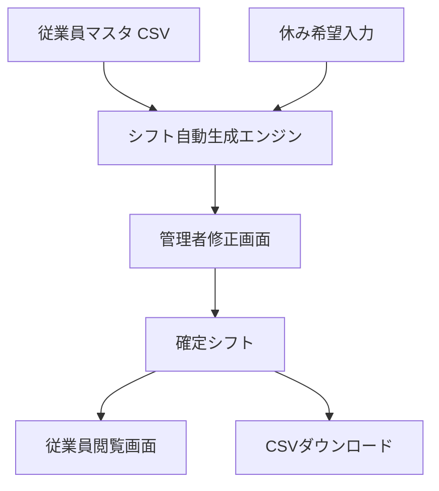
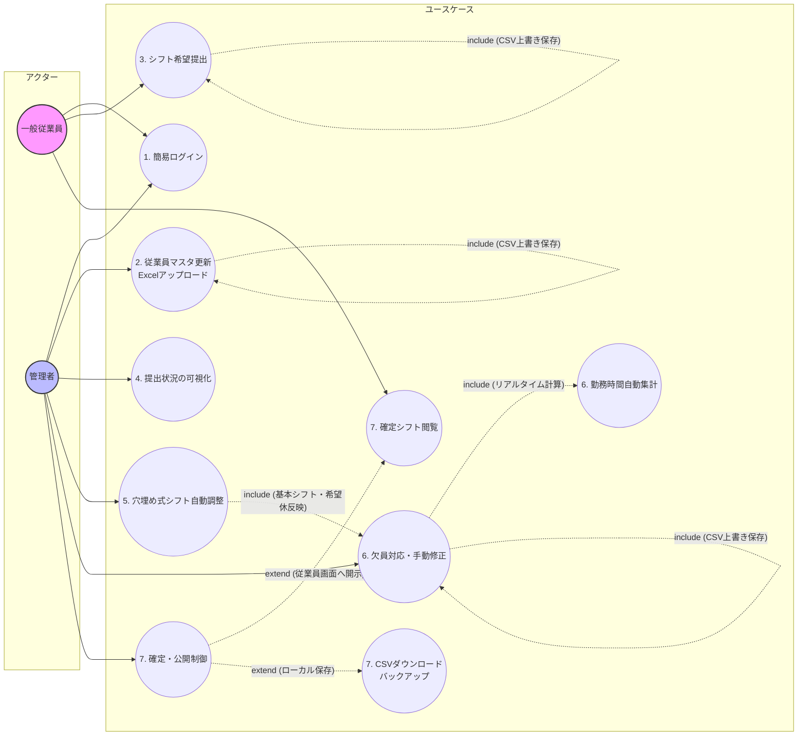
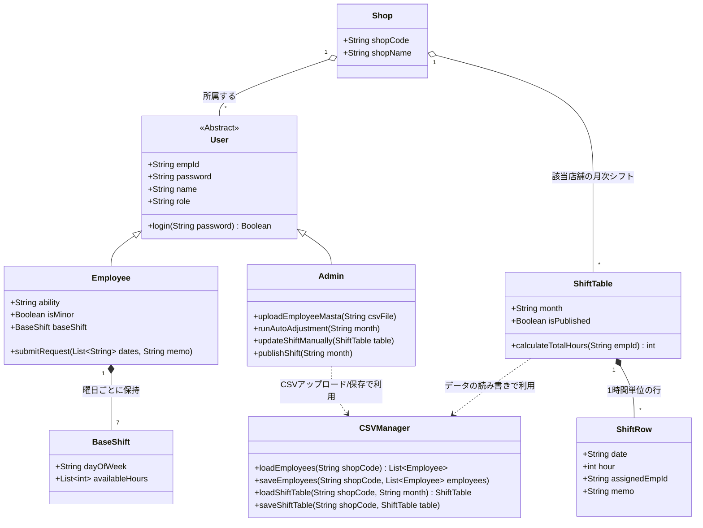
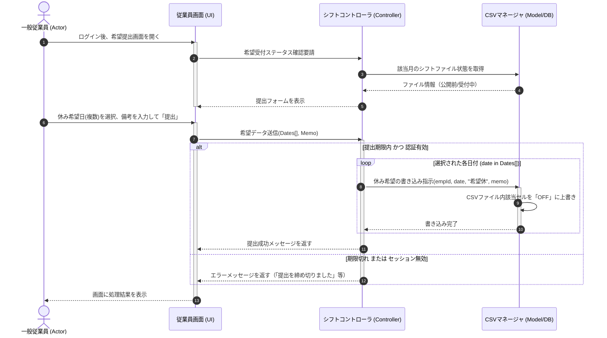
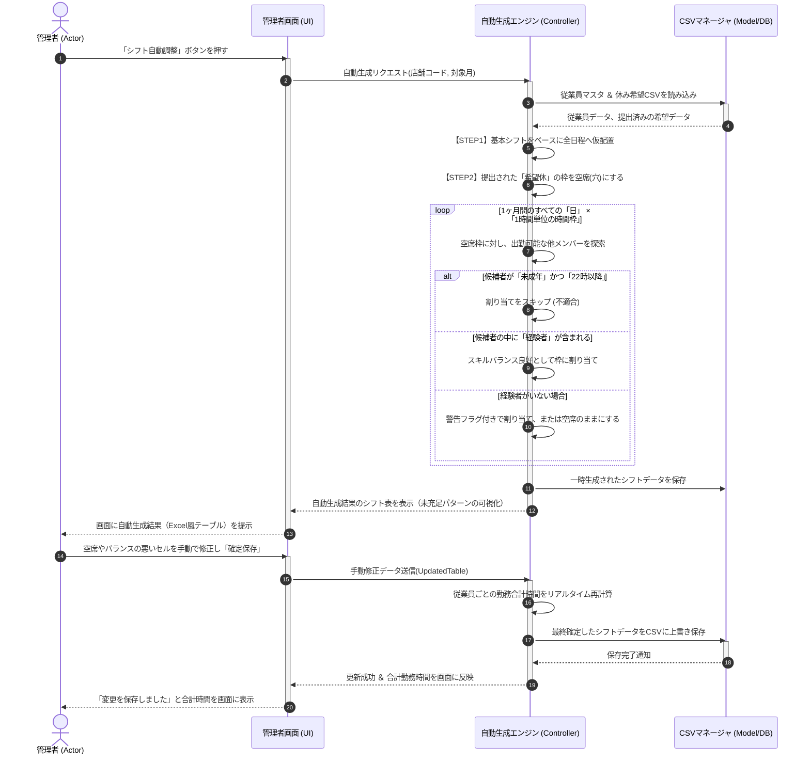
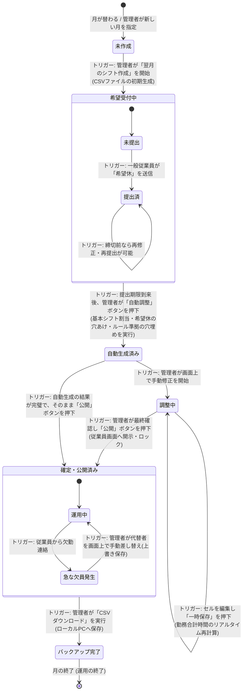

# sysytem_test

# シフト自動調整管理アプリ 要件定義書

## 1. プロジェクト概要

### システム名

簡易複数店舗対応型・シフト自動調整管理アプリ

### 開発期間

4週間

### 概要

複数店舗・部門に対応し，従業員の基本シフトと月次の休み希望を組み合わせて，スキルバランスや法令上の制約を考慮した月間シフト表を自動生成・管理するWebアプリケーションである．

### 使用技術

* Python
* Streamlit
* Streamlit Community Cloud
* CSVファイル管理

---

## 2. システム目的

本システムは，複数店舗におけるシフト作成業務を効率化することを目的とする．

以下の3ステップでシフトを作成する．

1. 基本シフトの自動配置
2. 希望休の反映
3. ルールベースの自動穴埋め

これにより管理者のシフト作成負担を軽減する．

---

## 3. システム構成



---

## 4. ユーザー区分

| 区分    | 利用機能               |
| ----- | ------------------ |
| 一般従業員 | 希望休提出，確定シフト閲覧      |
| 管理者   | 従業員管理，自動生成，手動修正，公開 |

---

## 5. 機能要件

### 共通機能

#### FR-01 簡易ログイン

* 店舗コード
* 従業員ID
* パスワード

を用いて認証を行う．

ユーザー権限に応じて画面を分岐する．

---

### 一般従業員機能

#### FR-02 希望休提出

* 日単位で休み希望を登録
* 備考入力可能
* 保存可能

#### FR-03 確定シフト閲覧

* 管理者公開後に閲覧可能
* 月間シフトを確認可能

---

### 管理者機能

#### FR-04 従業員マスタ管理

CSVアップロードにより一括更新を行う．

管理項目

* 基本シフト
* 経験者フラグ
* 未成年フラグ
* 所属店舗

#### FR-05 提出状況確認

各従業員の提出状況を表示する．

* 提出済
* 未提出

#### FR-06 シフト自動生成

以下のルールを適用する．

1. 基本シフトを配置
2. 希望休を反映
3. 空き枠を自動補完

##### 制約条件

* 各時間帯に経験者を1名以上配置
* 未成年者は22時以降勤務不可
* 未提出者は基本シフトを適用

#### FR-07 シフト手動修正

* セル単位編集
* ドロップダウン選択
* 即時保存

#### FR-08 労働時間集計

従業員ごとの総勤務時間を自動計算する．

#### FR-09 シフト公開

公開ボタン押下後に従業員へ反映する．

#### FR-10 CSV出力

完成したシフト表をCSV形式でダウンロードする．

---

## 6. 非機能要件

### 性能

* ログイン：5秒以内
* 画面遷移：5秒以内
* 自動生成処理：5秒以内

### セキュリティ

* 権限制御を実施
* パスワード暗号化は行わない

### ユーザビリティ

* Streamlit標準UIを利用
* 表形式編集を採用

### 保守性

* SQLは使用しない
* CSVファイル管理とする
* 手動修復可能なデータ構造とする

---

## 7. データ構造

### employees.csv

| 項目     |
| ------ |
| 店舗コード  |
| 従業員ID  |
| パスワード  |
| 氏名     |
| 役割     |
| 経験者フラグ |
| 未成年フラグ |
| 曜日     |
| 勤務開始時刻 |
| 勤務終了時刻 |

### shifts_YYYY_MM.csv

| 項目    |
| ----- |
| 日付    |
| 店舗コード |
| 時間    |
| シフト枠1 |
| シフト枠2 |
| 備考    |

---

## 8. 非目標

以下の機能は開発対象外とする．

* ユーザー新規登録
* パスワード再発行
* 時間単位の休暇申請
* 勤務時間超過アラート
* 給与計算
* 他システム連携
* LINE通知
* メール通知
* PDF出力
* 高度なセキュリティ機能

---

## 9. 開発優先度

| 優先度 | 対象機能                      |
| --- | ------------------------- |
| 高   | ログイン，休み希望，自動生成，マスタ管理，手動修正 |
| 中   | 提出状況確認，公開機能，労働時間集計        |
| 低   | なし                        |


# システム構成図

## 1. ユースケース図




## 2. クラス図



## 3. シーケンス図

### 3.1. 従業員のシフト提出


### 3.2. 管理者によるシフトの自動調整および手動調整


## 4. 状態遷移図


# 開発環境およびGitHubリポジトリ

## 開発環境

本システムは以下の環境で開発を行う．

### 使用言語

* Python 3.12

### 使用フレームワーク

* Streamlit

### 使用ライブラリ

* Pandas
* NumPy（必要に応じて）
* Datetime

### 開発ツール

* Anaconda
* Visual Studio Code
* GitHub

---

## 開発環境構築

Anaconda上で本プロジェクト用の環境を作成し，必要なライブラリをインストールした．

今回は開発効率を優先し，Anaconda環境内へ必要なライブラリをまとめて導入する構成とした．

環境構築後，Visual Studio Codeからプロジェクトフォルダを開き，開発を行う．

---

## 起動方法

### ライブラリのインストール

VScode上のコマンドシェルにて以下のコマンドを入力した

```bash
pip install streamlit pandas
```

### アプリケーション起動

コマンドプロンプトを起動し，以下のコマンドを入力してアプリを起動した

```bash
streamlit run C:\　Users\　ユーザ名\　OneDrive\　ファイル保存フォルダ\　autoshift.py [ARGUMENTS]
```

### 動作確認

以下のテストプログラムを作成し，ブラウザ上で画面表示されることを確認した．

```python
import streamlit as st

st.title("シフト自動調整管理アプリ")
st.write("開発環境の動作確認")
```

実行後，ブラウザ上にタイトルおよびメッセージが表示されることを確認した．

---

## GitHubリポジトリ
```text
github
└─system_test/
    ├── app.py                  # メインエントリポイント（セッション初期化、画面ルーティングを統括）
    ├── config.py               # クラウドDB接続設定、環境変数（st.secrets）の管理
    ├── requirements.txt        # 依存ライブラリの定義（streamlit, pandas, supabase または firebase-admin等）
    ├── database/
    │   └── storage.py          # データアクセス層（ローカルCSVの代わりにクラウドDBのCRUD処理を実装）
    ├── services/
    │   ├── employee_service.py # 従業員管理ビジネスロジック（バリデーションや削除時の安全ロック）
    │   ├── holiday_service.py  # 休み希望に関するロジック
    │   └── roster_service.py   # シフト自動生成アルゴリズム・人手不足（タイムカバー）チェック
    └── views/                  # 画面・UI表示層（旧関数の表示・入力ロジックをそのまま移設）
        ├── auth_view.py        # ログイン画面 ＆ 新規店舗・部門設立画面のUI
        ├── admin_view.py       # 管理者ダッシュボードのUI（各タブの表示含む）
        └── employee_view.py    # 一般従業員ダッシュボードのUI

```

現段階ではプロジェクト初期段階であり、
システム本体およびCSVデータは今後実装予定である。
現在は開発環境構築および要件定義・設計の段階である。

